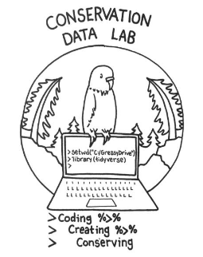

**Take Home Messages**

* Sometimes, to fill a gap, you have to create something new
* Seizing the moment is hard, but rarely regretted

I think the first volunteer I worked with was Nick Leach, a student at Northern Michigan University and a neighbor. He was working toward his GIS certificate and wanted practice with raster data (which represents data in same-sized squares, as opposed to vector data that uses points, lines, and polygons). He ended up doing a lot of work with LANDFIRE data—we had fun and quickly got to know each other. That was in 2013.
Fast forward to 2016, when we moved from Marquette, MI to Evanston, IL. I was almost instantly and almost completely removed from colleagues and friends, which illuminated a couple of big gaps in my life:

1. I do not have a PhD, which means I cannot have my own lab in a traditional sense (e.g., at a university). I love the focused purpose, the connections, and the creativity of a lab. Lacking a community in Evanston somehow brought this missing piece to the forefront.
2. At the time, I had not “made anything new” or created something notable. The move forced many new things on me, but I had not initiated them myself.

One day I basically woke up and thought, “I’ll create my own d$mn lab.” I wasn’t being strategic—no brainstorming over a beverage, no methodical attempt to fill these gaps. It seems my subconscious was doing that work, though.

Shortly after, I met two amazing high school students: Alanis Gonzalez (currently a PhD student in Classical Philology at Harvard) and Kati Gross (Conine Lab, University of Pennsylvania), as well as Shea Lutton, who at the time was focused on shaving milliseconds off stock trading messages. Alanis and Kati wanted to learn R, and I was just a few steps ahead of them, so we started that journey together. Similar to my experience with Nick, we didn’t just learn R—we got to know each other and ourselves. This was incredibly rewarding, a proto-CDL experience.

Shea has become a dear friend and an amazing thought partner—the original “board president” of the CDL. Not really—there is no board—but he’s a foundational force who said, “H&ll yeah! That’s a great idea!” when I told him I wanted to start my own d&mn lab.

After we returned to Marquette, I met Laura Slavsky (a resilience forester with The Nature Conservancy). She was an intern with TNC at the time, and I awkwardly asked her—while literally passing her in the hallway—if she wanted to join this CDL thing. She recruited Myles Walimaa, then Brandon Caltrider. I recruited Mathurin Gagnon, and the CDL was born. Soon after, others joined. Those early members set the tone, atmosphere, and direction that really hasn’t changed much.

The idea of the CDL was born in a sort of vacuum and occupied my brain in a wonderful way until we moved back to Marquette. Laura and I seized the moment—and wow, it’s hard to overestimate the impact those few awkward moments have had. We seized the moment, and now, with these blog posts, I’m trying to look back and celebrate what starting the CDL has meant to me.

 
 

Here's the original CDL logo by Chloe Walimaa (https://chloeleacreations.square.site/).  She also created the current logo.

