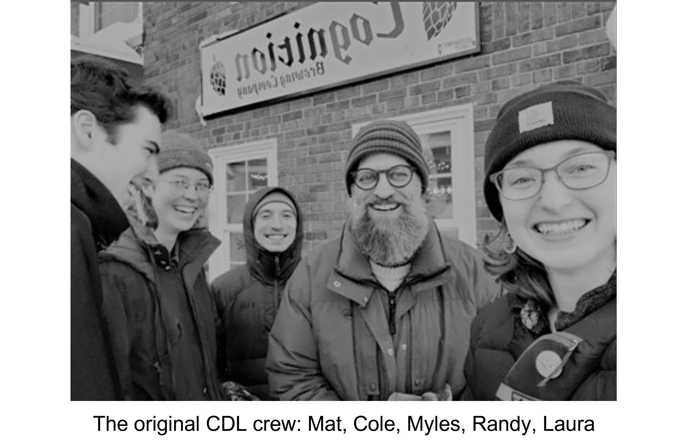

**Take Home Messages**

* We all need “in-between” spaces. Growth often happens outside formal structures—where expectations are low but curiosity is high.
* Discomfort is not failure—it’s the work. If you don’t know what you’re doing, you’re probably learning something that actually matters.
* Community accelerates learning. Working alongside others helps you think, adapt, and solve problems in ways you can’t do alone.

I have always loved those high school teachers who keep their room doors open at lunch, welcoming students who do not want to eat in the cafeteria. My wife is one of those teachers—all of the English Language Learners know they can hang in the “romper room.” My high school band director would keep his doors open and always had music playing. The Conservation Data Lab aims to be the room you can go to hang out and be who you want to be.

Those rooms mattered more than I realized at the time. They weren’t just places to sit—they were places to belong. No syllabus, no expectations, just a shared understanding that you could show up as you are and figure things out as you go.
We all need places to explore, whether a mountain pass, a blank canvas or a science fiction book. These are the “grey areas”—not fully work, not fully school—where we can try new things, fail, succeed in surprising ways and see how other people operate. They are messy by design. There is no clean path, no step-by-step recipe. That’s kind of the point.

The CDL aims to be that too. Not school, not work, not quite a club. It’s weird that way and a bit hard to define. We do provide places for people to converse about decisions, dabble in conservation-focused projects and experience the trials and tribulations of problem solving when there is no recipe. “Randy, I am so frustrated. I have never done any of this before and I have no idea what I am doing!”
An almost direct quote from an early CDL member who was not happy at that moment :).

That frustration is real—and important.

When there’s no recipe, you’re forced to build one. You learn not just what works, but how to think when nothing is clear. That’s a skill that doesn’t show up in a syllabus but shows up everywhere else.

The great [Dr. Tad Theimer](https://directory.nau.edu/person/tct) (also see his re-enactments of Charles Darwin [here](https://youtube.com/playlist?list=PLOxcuG1TDP_FYf4s7SrqFHM2ul5kTsphg&si=55aSltRW-_657FH2)) once asked me a few years after I graduated, “Randy, what all did we miss in our training of you?” What a great question. While I was lucky in that there was a very vibrant lab culture, my advisers were accessible and the department was welcoming, I did not have that place where I could be myself and practice my future craft. What we “missed” wasn’t content—we had plenty of that. It was a place to practice becoming something before we had a title for it. No one knew where I would end up, but I knew I wasn’t going on in academia. I needed a “romper room” with conservationists, other professionals in the field. The CDL tries to at least connect members with professionals when they want it.

The Conservation Data Lab is still a bit hard to define, and maybe that’s a good thing. It’s a room with the door open. A place to try, to fail, to ask questions that don’t have clean answers.

Some days it feels like chaos. Some days it clicks.

But if we’re doing it right, it’s a place where people can sit down, stay a while, and leave a little more capable—and a little more themselves—than when they walked in.

 
 

Here's the original CDL crew looking like a new indie-rock band.  Photo by Laura Slavsky. 

